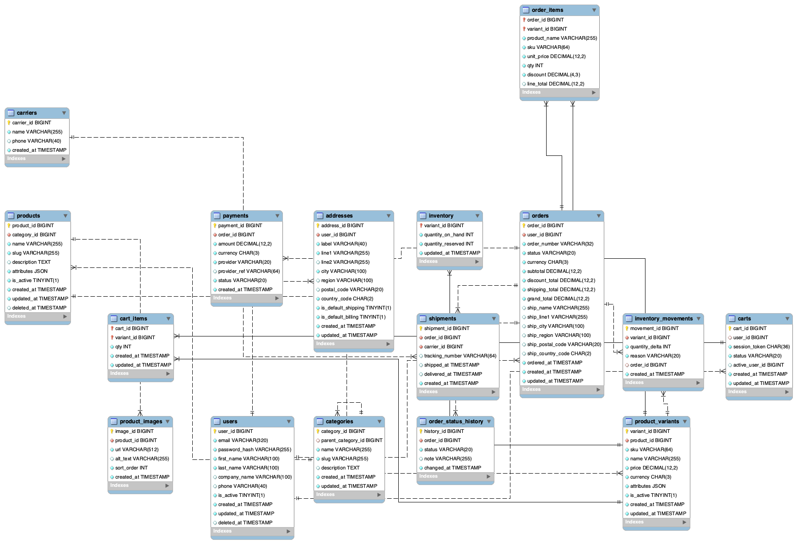

# E-Commerce Business & Product Analysis | MySQL

## Project Overview
This project analyzes a transactional e-commerce database using MySQL to answer multiple business questions across customer behavior, revenue performance, product performance, and order operations.

The goal was not only to produce working SQL queries, but to show the analytical reasoning behind them. Each question in the SQL file includes a short **Approach** explaining why the query was structured that way and, where relevant, a business **Insight** from the result.

## Business Objectives
- Understand customer activity, purchasing behavior, and repeat purchasing.
- Identify high-value customers and measure completed customer spending.
- Track delivered revenue, average order value, and month-over-month growth.
- Compare discounted and non-discounted revenue.
- Identify top-performing products and categories.
- Find products with no completed sales.
- Measure shipping performance and carrier efficiency.
- Identify bottlenecks in the order lifecycle.

## Analysis Structure
The project contains 20 questions organized into four sections:

### 1. Customer Analysis
Registered and active users, customers with and without orders, average order frequency, top customers by completed spending, and one-time vs. repeat purchasers.

### 2. Sales & Revenue Analysis
Average customer spending, AOV, monthly delivered revenue, month-over-month growth, and discounted vs. non-discounted revenue.

### 3. Product Performance
Top products by revenue, top products within each category, above-average performers, category/product rollups, and products with zero delivered sales.

### 4. Order & Operational Analysis
Order-to-shipment and order-to-delivery time, longest deliveries, carrier performance, lifecycle-stage duration, and highest-value customers.
## Database Schema

The diagram below shows the structure of the e-commerce database and the relationships between the 16 tables used in the analysis.



## SQL Skills Demonstrated
- `INNER JOIN` and `LEFT JOIN`
- Multi-table joins
- `GROUP BY` and `HAVING`
- Aggregate functions: `COUNT`, `SUM`, `AVG`, `MIN`, `MAX`
- Conditional aggregation and `CASE`
- Common Table Expressions (CTEs)
- Scalar subqueries
- Window functions: `LAG`, `LEAD`, `RANK`
- `PARTITION BY`
- `WITH ROLLUP`
- `COALESCE`
- Date functions: `DATE_FORMAT`, `DATEDIFF`, `TIMESTAMPDIFF`
- Top-N and Top-N-per-group analysis

## Selected Business Insights
- 89 of the 91 registered users placed at least one order in the sample data.
- Repeat purchasing is dominant among customers who completed purchases.
- Discounted orders generated slightly more delivered revenue than non-discounted orders, but revenue alone is not enough to conclude that discounting improves performance.
- July 2006 and May 2008 are partial months in the dataset, so their month-over-month growth figures should be interpreted cautiously.
- The `paid` stage is the largest order-lifecycle bottleneck, averaging approximately **203.31 hours** before the next status change.
- The `shipped` stage averages approximately **72 hours**, while `pending` averages approximately **1.03 hours** before the next stage.
- Carrier-level delivery analysis identifies Shipper ZHISN as the fastest carrier in the sample based on average order-to-delivery time.
- Giorgio Veronesi generated the highest delivered revenue in the customer-value analysis.

## Analytical Decisions
Revenue and spending analyses use **delivered orders** when the objective is to measure completed purchases. Product-level revenue is calculated with `order_items.line_total` instead of `orders.grand_total`, preventing the full value of an order from being assigned to every product in that order.

The SQL file also includes comments that explain the reasoning behind more complex choices—for example, why a CTE is needed before a second aggregation, why `LAG()` is used for month-over-month comparison, why Top 3 per category requires a window function instead of `LIMIT`, and why the delivered-order condition is placed inside the `LEFT JOIN` in the zero-sales analysis.

## Repository Files
```text
ecommerce-sql-analysis/
├── README.md
├── ecommerce_business_analysis.sql
└── images/
    └── schema.png
```

- `ecommerce_business_analysis.sql` — complete analysis with 20 business questions, reasoning, and selected insights.
- `README.md` — project overview, analytical scope, SQL skills, and findings.
- `images/schema.png` — database schema / ERD for quick reference.

## Dataset
The project uses the MySQL e-commerce sample database from the `harryho/db-samples` repository. The schema includes users, orders, order items, products, product variants, categories, shipments, carriers, payments, inventory, and order-status history.
